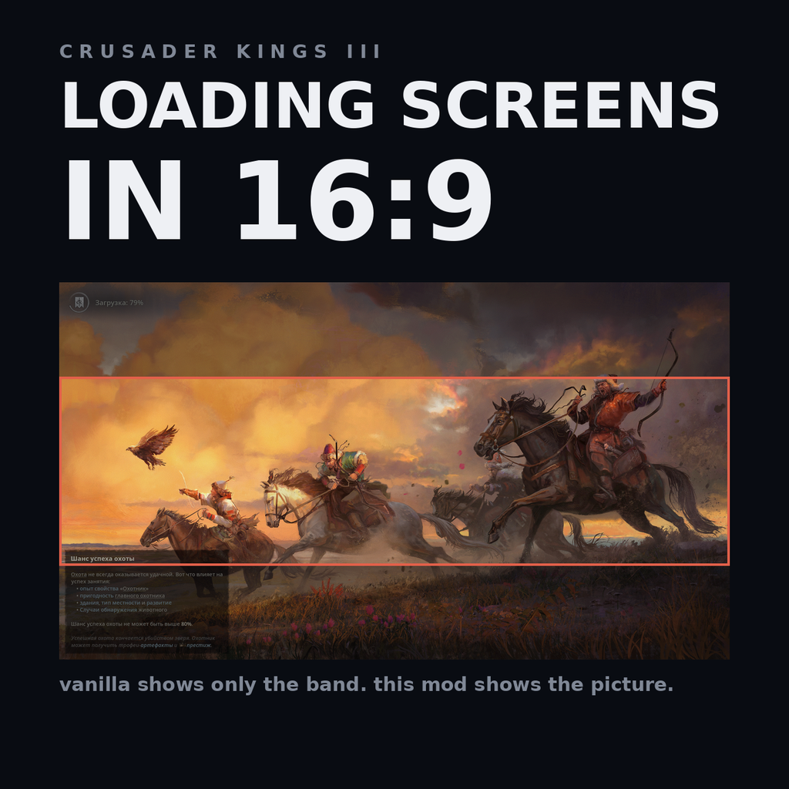

# 16:9 Loading Screens (CK3)

Draws loading screens at their native 16:9 instead of cropping them to the
shape of the display, and moves the progress spinner, the status text and the
loading tip into that same frame.

The name is deliberate. This changes an aspect ratio; it does not add wider
artwork, and calling it an ultrawide fix would invite people to expect
full-width illustrations that do not exist.

How much it matters depends on how wide the display is:

| display | cover scale | illustration visible |
| --- | --- | --- |
| 16:9 | 1.000 | all of it - the mod changes nothing |
| 21:9, 3440x1440 | 0.896 | 74% |
| 32:9, 5120x1440 | 1.333 | 50% |

## Cause

Every loading screen the game ships is **3840x2160** - exactly 16:9. That is
true of all five base game images and all ten that come with DLC; there is not
a single odd one:

    game/gfx/interface/illustrations/loading_screens/*.dds      5 files
    game/dlc/*/gfx/interface/illustrations/loading_screens/*.dds   10 files

`game/gui/preload/frontend_loadingscreen.gui` draws that image with

    background = {
        texture = "[GetCurrentLoadingScreen]"
        fittype = centercrop
    }

`centercrop` is a cover fit: the image is scaled until it covers the window
in both directions and the overflow is cut. On 5120x1440 the scale it picks is
`max(5120/3840, 1440/2160)` = `max(1.333, 0.667)` = **1.333**, so the image is
drawn at 5120x2880 and the viewport keeps 1440 of those 2880 rows. Half the
artwork - the top quarter and the bottom quarter - is cropped away, and what
is left is a letterbox slice through the middle.

The progress spinner and the loading tip are anchored to the corners of the
full screen, so on a wide monitor they also drift far away from the picture.

## Fix

Two files are overridden.

**`gui/preload/frontend_loadingscreen.gui`** puts the artwork, the spinner and
the version number inside a 16:9 stage:

    widget = {
        parentanchor = center
        size = { 1920 1080 }
        scale = "[ScaleToFitElementInside('(int32)1920', '(int32)1080')]"
        ...
    }

`ScaleToFitElementInside` is `min(w/1920, h/1080)`, so on 5120x1440 the stage
is 2560x1440 and centred: the whole image, nothing cropped. This is not a new
trick - vanilla `frontend_main.gui` uses the exact same three lines in three
places, which is why the main menu has never had this problem.

Behind the stage, the same image is drawn again with the vanilla `centercrop`
and a `color = { 0.22 0.22 0.22 1 }` multiplier. The sides are then a dimmed
continuation of the same artwork rather than two black bars. For plain black
instead, swap that background for
`texture = "gfx/interface/colors/black.dds"` - the comment in the file marks
the spot.

The type also gains `block "loading_screen_extra"` inside the stage.

**`gui/frontend_loadingscreen_savegame.gui`** moves the loading tip into that
block. Without this the tip stays a child of the full-screen widget and keeps
hugging the bottom left corner of the monitor.

## Verified, and not

Confirmed in game on 5120x1440: the full illustration is shown, the sides are
a dimmed continuation of it, and the spinner and the tip sit inside the frame.

Not checked on an actual 16:9 display. There `ScaleToFitElementInside` returns
the same scale `centercrop` did, so the result should be pixel-identical to
vanilla except that the dimmed backdrop ends up fully covered by the stage -
but that is reasoning, not a test.

One thing worth knowing if it misbehaves: `gui/preload/` is loaded before the
rest of the GUI, and the vanilla file opens with a warning that it cannot use
types or templates from other files. `ScaleToFitElementInside` is an engine
function rather than a template, so it should be available - but that is the
first thing to suspect if the loading screen comes out wrong.

## Layout

    descriptor.mod                              mod metadata
    thumbnail.png                               Workshop preview, must sit in the mod root
    gui/preload/frontend_loadingscreen.gui      overrides the same vanilla path
    gui/frontend_loadingscreen_savegame.gui     overrides the same vanilla path
    install.sh                                  copies the mod into the Proton prefix
    steam-workshop/                             listing texts for Steam and Paradox Mods
    tools/make_thumbnail.py                     rebuilds thumbnail.png from a screenshot
    tools/bbcode_to_plain.py                    rebuilds the Paradox Mods texts

The mod directory inside the prefix is still `ultrawide_loading_screens`, from
before the rename. Changing it would break the launcher's playset entry and
buy nothing - the directory name is not shown anywhere.

## Installing

Run `./install.sh`. It copies the mod into the CK3 mod directory **inside the
Proton prefix**:

    ~/.local/share/Steam/steamapps/compatdata/1158310/pfx/drive_c/users/steamuser/
      Documents/Paradox Interactive/Crusader Kings III/mod/

That is the path the game and the Paradox launcher actually use under Proton.
`~/.local/share/Paradox Interactive/Crusader Kings III` is the native-Linux
location and is *not* read by the Proton build.

Close the launcher before installing, then start it and enable
"16:9 Loading Screens" in the playset. `install.sh` only places the
files; it cannot add the mod to a playset, because that lives in the
launcher's own `launcher-v2.sqlite`.

Because `gui/preload/` is read before anything else, the change shows up on
the very first loading screen after the game starts.

## Compatibility

Both files are full replacements and conflict with any other mod that edits
them - which in practice means other loading screen mods. Mods that only *add*
new loading screen images do not conflict, and they benefit: any 16:9 image
they add is shown whole like the vanilla ones.

## Game version

Built against 1.19.0.6 (Scribe). GUI overrides fully replace the vanilla file,
so after a game patch re-diff both files against
`<steam>/Crusader Kings III/game/gui/`.
